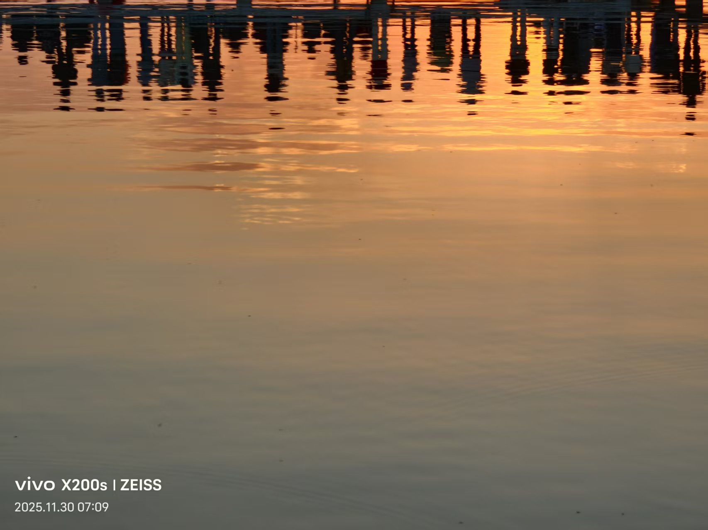
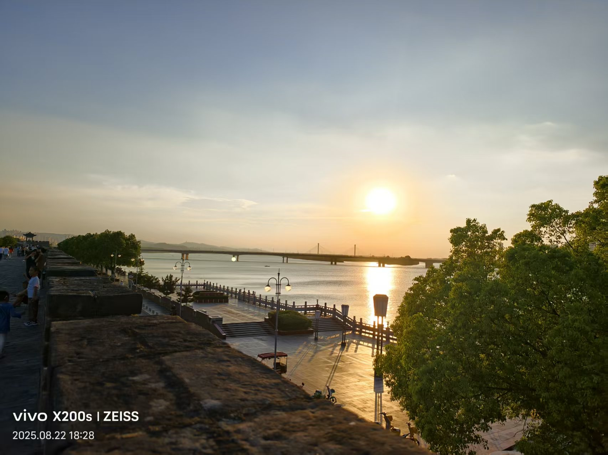
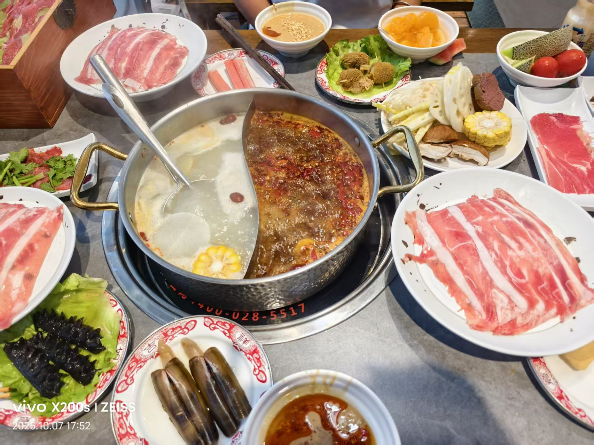
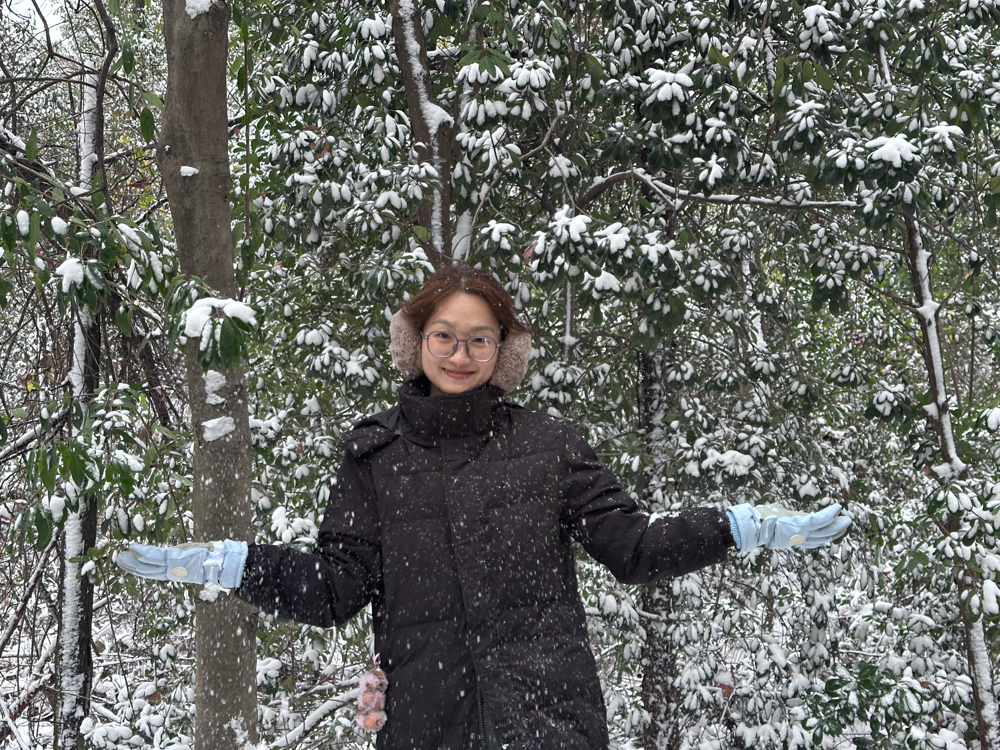

我是一名硕士研究生，专注于**土壤固碳**研究。
喜欢用 Quarto 搭建学术网站和数据分析报告，致力于将复杂的土壤科学问题转化为清晰直观的数据可视化成果。

---

## 🏫 教育经历
- **硕士**：华中农业大学 土壤学专业（2025-至今）
  - 导师：渠晨晨副教授
  - 研究课题：南北土壤有机质分析
- **本科**：河南农业大学 资源与环境专业（2021-2025）
  - 毕业设计：重金属镉的污染修复
  - 毕业设计成绩：优秀

---

## 🔬 研究方向
- 土壤颗粒有机质（POM）的光谱表征
- 同步辐射红外成像技术在土壤学中的应用
- 土壤碳库组分与环境响应的数据分析
- 机器学习在土壤光谱预测模型中的应用

---

## 🎨 个人爱好

### ✈️ 旅行与摄影
::: {.photo-row}
::: {.photo-item}
{width="260" style="border-radius: 8px; border: 1px solid #e3f2fd;"}

:::
::: {.photo-item}
{width="260" style="border-radius: 8px; border: 1px solid #e3f2fd;"}

:::
:::

我热爱在旅途中记录自然与城市的光影，用镜头捕捉城市与人文的联结。作品风格偏向自然纪实，偏爱清晨与黄昏的柔和光线。

---

### 📚 日常生活
::: {.photo-row}
::: {.photo-item}
{width="260" style="border-radius: 8px; border: 1px solid #e3f2fd;"}

:::
::: {.photo-item}
{width="260" style="border-radius: 8px; border: 1px solid #e3f2fd;"}

:::
:::

- 闲暇时喜欢去吃美食和旅行，享受自然风光
- 坚持每周运动，喜欢慢跑和游泳，保持良好的生活状态
- 偶尔逛街，买些衣服跟吃些小吃，享受生活的烟火气

---

## 📫 联系方式
- **邮箱**：2025303110054@qq.com
- **GitHub**：[github.com/jiang_yu_yang](https://github.com/jiang_yu_yang)
- **实验室**：华中农业大学资环楼实验室